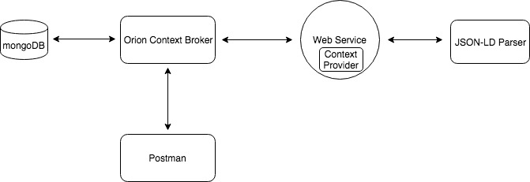

# WoTExperiments

This repository shows a proof of concept that integrates Wob of Things through a Context Provider in Orion Context Broker.  The application provided here is a Web of Things servient that has been integrated with Orion Context Broker.

## Prerequisites

- docker
- docker compose
- maven

## Architecture

Components for this software demo is described as follows:

- Parser: it parses the Thing Description (JSON-LD) provided in the as input config for the spring-boot application. The parser aims to retrieve the properties for each of the things described in each JSON-LD file with its accompanying details. Here we intend to store in a map data structure each property with its info about how to retrieve values for each. This process is done in the runtime of the application.

- REST Service: The web service works as a REST-API to retrieve information about the Thing Descriptors. It extracts the values of each of the properties in an NGSI-V1 format to be compatible when queried by Orion Context Broker.

- Postman is a RESTful- API client uses to query Orion Context broker.
- Orion Context broker uses mongo to store its intermediate information

For more information about the concept of Context Provider, please check this tutorial [Context Provider](https://github.com/Fiware/tutorials.Context-Providers).

For more information about Thing Description and JSON-LD, please check [W3C Thing Description specification](https://w3c.github.io/wot-thing-description/)

.

## How to run the example

the following bash command uses maven to dockerize the spring-boot application in an image called "wotcp".

```console
mvn package -Pdocker
```
then we can start the docker-compose file to run the component described above at the same time (Orion CB, wotcp, mongodb)

```console
docker-compose orion up
```


## Thing Descriptor Information

We can query the Thing Descriptor that has been provided and the properties for each by:

```console
curl --request GET --url http://localhost:8080/properties 
```

The response contains the name of each Thing Description file, the properties described in each JSON-LD file and the address to get the values for each of the properties. Here we use the [http://gateway.webofthings.io/](http://gateway.webofthings.io/)


```json
{
    "Room02": {
        "temperature": "http://gateway.webofthings.io/properties/temperature"
    },
    "Room01": {
        "myTemp": "http://gateway.webofthings.io/properties/temperature",
        "myHumidity": "http://gateway.webofthings.io/properties/humidity"
    }
}
```

## Simulate the Orion CB request for querying context information

```console
curl --request POST \
  --url http://localhost:8080/queryContext \
  --header 'Accept: application/json' \
  --header 'Content-Type: application/json' \
  --data '{
    "entities": [
        {
            "type": "Room",
            "isPattern": "false",
            "id": "Room02"
        }
    ],
    "attributes": [
        "temperature"
    ]
}'
```

response

```json
{
    "contextResponses": [
        {
            "contextElement": {
                "attributes": [
                    {
                        "metadatas": [
                            {
                                "name": "timestamp",
                                "type": "DateTime",
                                "value": "2018-11-20T10:08:31.171Z"
                            }
                        ],
                        "name": "temperature",
                        "type": "Number",
                        "value": "6"
                    }
                ],
                "id": "Room02",
                "isPattern": "false",
                "type": "Room"
            },
            "statusCode": {
                "code": "200",
                "reasonPhrase": "OK"
            }
        }
    ]
}
```

## Entity Creation

```console
curl --request POST \
  --url 'http://{{orion}}/v2/entities/' \
  --header 'Content-Type: application/json' \
  --data ' {
      "id":"Room02",
      "type":"Room",
      "name": {
      	"type":"Text",
      "value":"Room02"
      }
}'
```

## Retrieve Entity Information

the following request will retrieve the local entity in the Orion Context Broker

```console
 curl --request GET --url 'http://{{orion}/v2/entities/Room02'
```

```json

{
    "id": "Room02",
    "type": "Product",
    "name": {
        "type": "Text",
        "value": "Room02",
        "metadata": {}
    }
}
```

## Context Provider Registration

In order to get information from the Web of Things you need to register Context provider in Orion Context Broker. Note that in the registration we put a url for the provider which is here the REST Service endpoint we described above.

```console
curl --request POST \
  --url 'http://{{orion}}/v2/registrations' \
  --header 'Content-Type: application/json' \
  --data '{
   "description": "Room02 - Web of Things",
   "dataProvided": {
     "entities": [
       {
         "id" : "Room02",
         "type": "Room"
       }
     ],
     "attrs": [
     	"temperature"
    ]
   },
   "provider": {
     "http": {
       "url": "http://wotcp:8080"
     },
     "legacyForwarding": true
   },
   "status": "active"
}'
```

list all regestrations

```console
curl -X GET --url http://localhost:1026/v2/registrations
```

```json
{
   "description": "Sensor2 web of Thing",
   "dataProvided": {
     "entities": [
       {
         "id" : "Sensor2",
         "type": "Product"
       }
     ],
     "attrs": [
     	"temperature"
    ]
   },
   "provider": {
     "http": {
       "url": "http://wotcp:8080"
     },
     "legacyForwarding": true
   },
   "status": "active"
}
```

To check if the context provider is able to retrieve values. We can Notice here that we have the information for the Room's Temperature, whereas if we went back the example above where we retrieved the local entity, the information was only the information we have created inside the Orion Context Broker.

In this entity we got one more property (temprature) with its value, it is the same temperature value the Web of Thing is Providing.

curl --request GET --url 'http://{{orion}}/v2/entities/Room02'

```json

{
    "id": "Room02",
    "type": "Room",
    "name": {
        "type": "Text",
        "value": "Room02",
        "metadata": {}
    },
    "temperature": {
        "type": "Number",
        "value": "40",
        "metadata": {
            "timestamp": {
                "type": "DateTime",
                "value": "2018-11-20T10:21:21.978Z"
            }
        }
    }
}

```